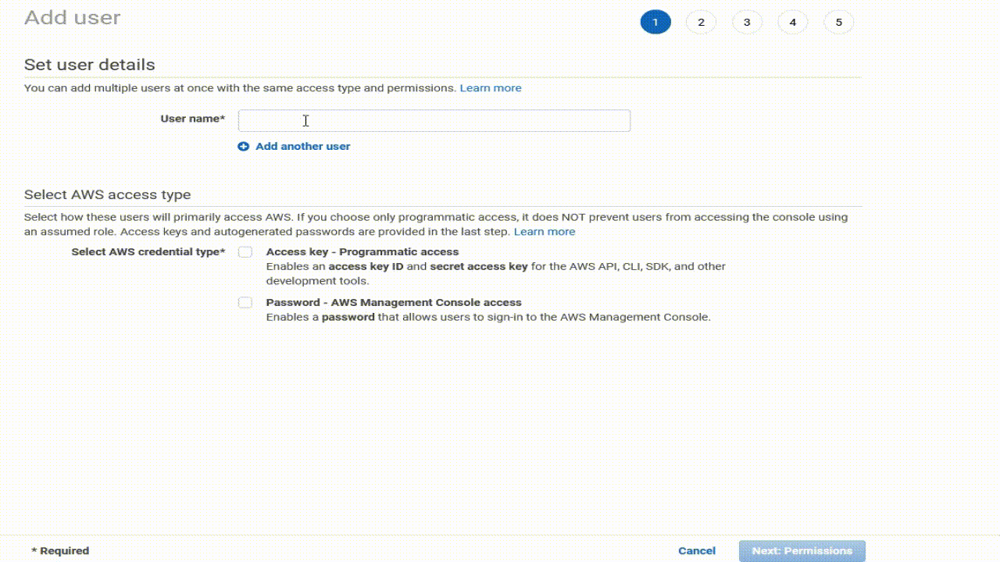
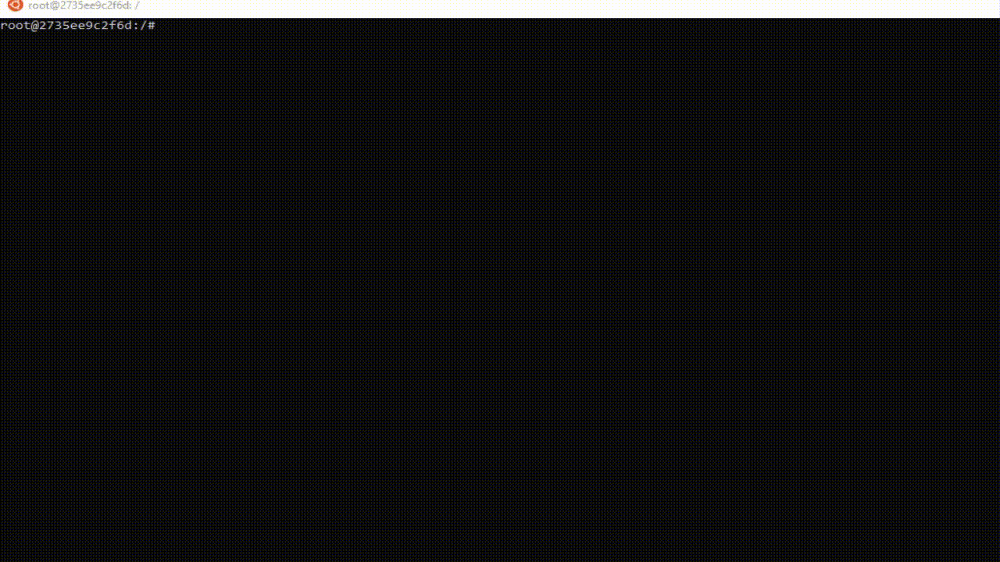
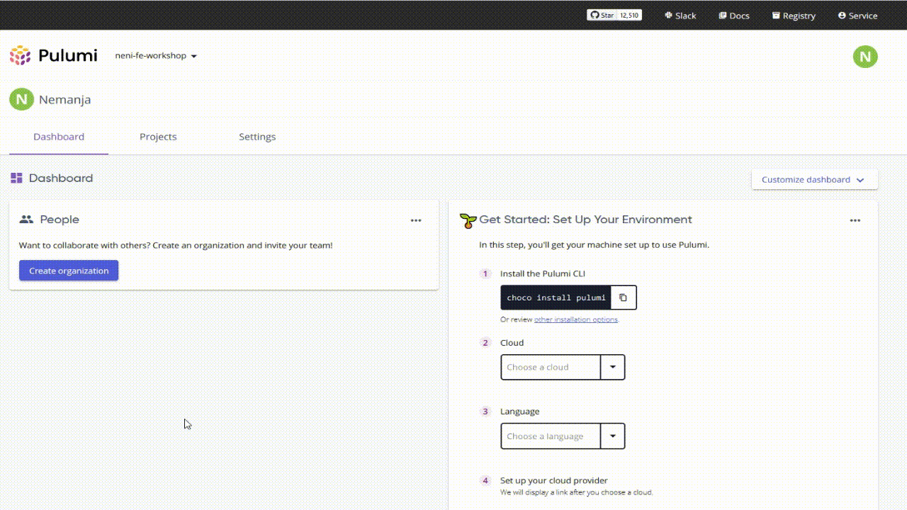

# Cloud for web applications workshop

# Before the workshop

## Prerequisite

1. Install Docker
2. Set up an AWS account
3. Create a [Pulumi account](https://app.pulumi.com/signin)

## Installing Docker

Docker is free to use and install for [personal and education projects](https://www.docker.com/pricing/).

If you are running Windows, [please use WSL2](https://docs.docker.com/desktop/windows/install/) since it works much better on Windows.

## Setting up the AWS account and user

Important: In order to attend this workshop you need to create your own AWS account.
We won't be generating any costs during this workshop. We will also close the account after the workshop is completed.

To create an AWS account, please follow [these instructions](https://aws.amazon.com/premiumsupport/knowledge-center/create-and-activate-aws-account/)

## Create a Pulumi account

Please visit [Pulumi sign up](https://app.pulumi.com/signin) page to create an account.

# During the workshop

## Creating an AWS user

You can also look at the video below.

- Log in with the root user account (see above)
- Go to IAM dashboard
- Select **Users** on the left side and click **Add users** button in the top right
- For username, please use the following convention **<your-Zuhlke-shortcode>-fe-workshop** e.g. *neni-fe-workshop*
- Select both **Programmatic access** and **AWS Management Console access** options
- You can untick the **Require password reset** box
- Go to the next page
- Select the **Attach existing policies** box
- Search and select **AdministratorAccess**
- Go to the next page
- We won't be adding any tags so we can skip this one
- Review the details and click the **Create user** button
- **Important**: Download the `.csv` file with credentials and store it.
You won't be able to access this page anymore

## Starting the dev environment

Note: Please adjust the paths to match your directories

Note: For Windows and WSL2, checkout this repo somewhere on the WSL path e.g. `\\wsl$\` and mount the container from there.

To set up your dev environment, run below:

`docker build -t cloud-for-web-apps-dev-environment .`

`docker run -d --name dev-env --mount type=bind,source="$PWD",target=/app --mount type=bind,source=/home/nemanja/.aws,target=/root/.aws -p 4444:3000 -p 4555:4200 cloud-for-web-apps-dev-environment`

For WSL2 and Windows run:

`docker run -d --name dev-env --mount type=bind,source="$PWD",target=/app --mount type=bind,source=/mnt/c/Users/neni/.aws,target=/root/.aws -p 4444:3000 -p 4555:4200 cloud-for-web-apps-dev-environment`

This command `docker exec -it dev-env /bin/bash` will open up the terminal inside your dev environment container.
Run your commands from this terminal only as it has all the tools that are needed, you don't need to install anything.

## Adding AWS profile

You can also look at the video below.

- Ensure you are running the terminal inside your Docker container
- Run `aws configure --profile <your-zuhlke-shortcode>-fe-workshop`
- Follow the steps and copy the secret and access key from the `new_user_credentials.csv` file. See above step on creating AWS user
- For region please key in `ap-southeast-1`
- For output name you can skip by pressing `Enter`

## Connecting the repo with your Pulumi account

You can also look at the video below.

- Log in to your Pulumi account
- Click **Settings** and select **Access Tokens** in the left menu
- Create a new token and store the token somewhere
- Open the terminal inside your Docker container
- Run `pulumi login` and pass the token that we just created
- Run `pulumi stack` and select **create new stack**
- Name your stack `dev`
- Configure Pulumi to use your AWS profile by running `export AWS_PROFILE=<your-zuhlke-shortcode>-fe-workshop`

## Deploying the infrastructure 

Our infrastructure is located in `index.ts`. To deploy it we need to run `pulumi up` command.

## Publishing the web app with Docker to ElasticBeanstalk

This repo contains a handy script called `deploy-eb.sh`. This script will create a zip file called `web-app.zip`.
The zip file then needs to be uploaded to ElasticBeanstalk via AWS console.

## Publishing the web app to S3

This repo contains a handy script called `deploy-s3.sh`. This script will build your app and deploy it to the bucket.

## Running the web app locally

While inside the container `cd` into `app/src/web-app` and run `npm start`.
Navigate to the app at `http://localhost:4444`

## Running the admin app locally

While inside the container `cd` into `app/src/admin-app` and run `npm start`.
Navigate to the app at `http://localhost:4555`